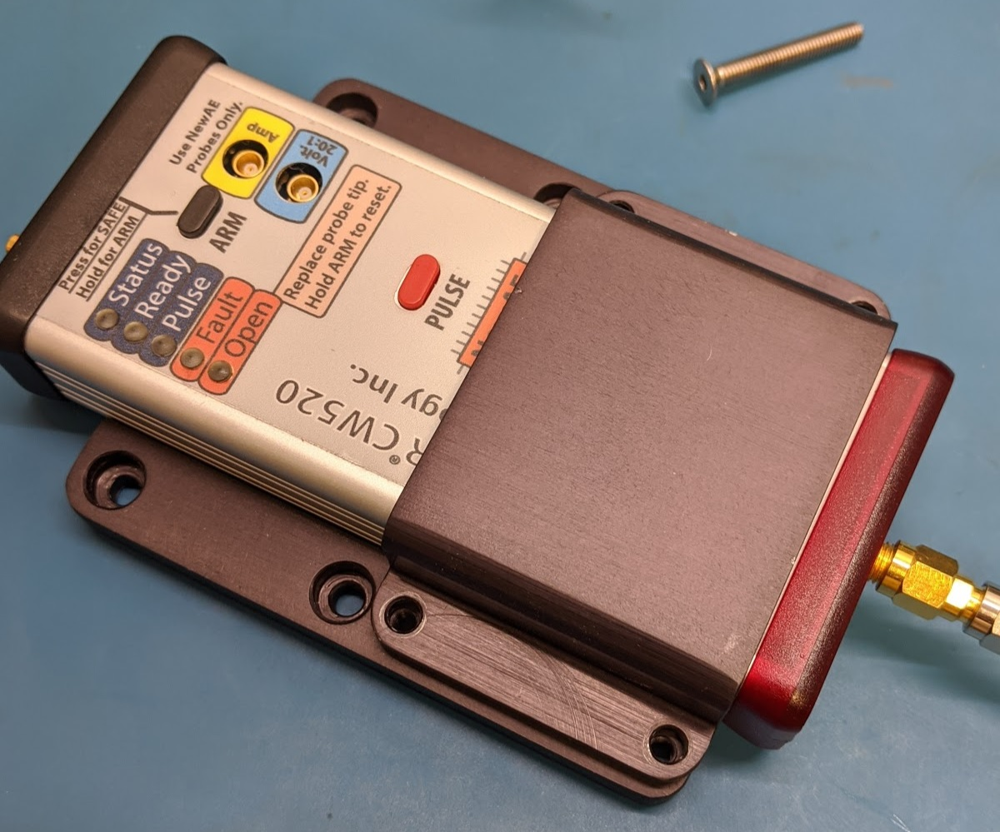
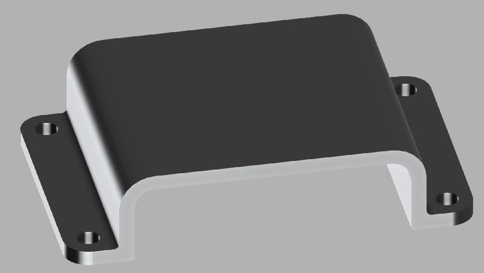

## ChipSHOUTER 3D Mount

A simple ChipSHOUTER mount is used by our XY table. You can modify this for your own use, for example to mount the ChipSHOUTER onto a 3D printer or gantry.

## Top Side

You can download this file in various formats from:
https://a360.co/2vIFLQQ

## Bottom Side

You can download this file in various formats from:
https://a360.co/37BaIUu

Note this has four M4x0.7 holes which hold the top U-mount onto the bottom plate. You will need appropriate M4 holes if you follow this same design.